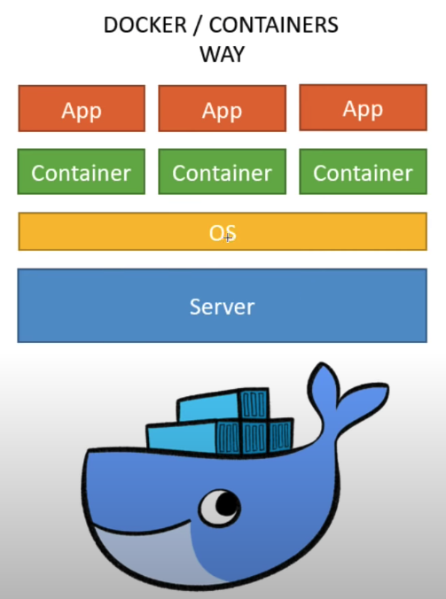

# 🐳 Docker Example 🐳

Simple example using on using Docker

## Docker Structure



## Pre-requisite

- [docker desktop](https://hub.docker.com/editions/community/docker-ce-desktop-mac)
- [docker hub account](https://hub.docker.com/)

## Scripts

```shell
# List current docker processes
docker ps

# Build a docker image (username/name of image) + path
docker build -t {name}/demoapp:1.0 .

# Port forwarding from Local: Container
docker run -p 5000:8080 {3160ac25cd26}

# Creating a shared file
docker volume create shared-stuff

# Get image from a container registry
docker push

#Docker Compose
# Finds file and runs all the containers
docker-compose up

# Finds file and stops all the containers
docker-compose down

```

## Resources

- [Docker Docs](https://docs.docker.com/docker-hub/)
- [hub.docker.com/](https://hub.docker.com/)
- [Learn Docker in 7 Easy Steps by Fireship (Video)](https://www.youtube.com/watch?v=gAkwW2tuIqE)
- [Exploring Docker [1] - Getting Started by Traversy Media(Video)](https://www.youtube.com/watch?v=Kyx2PsuwomE)
